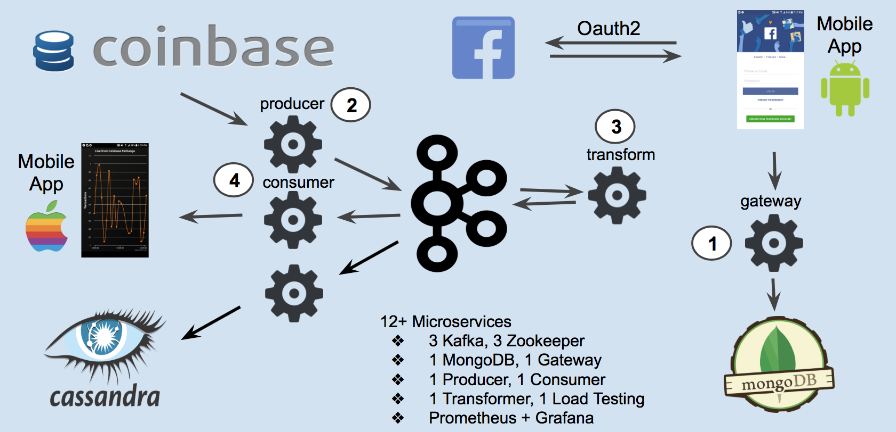
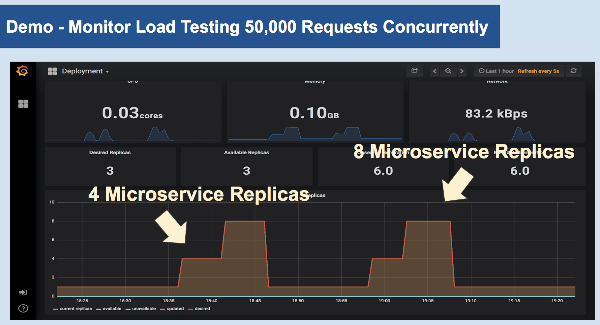
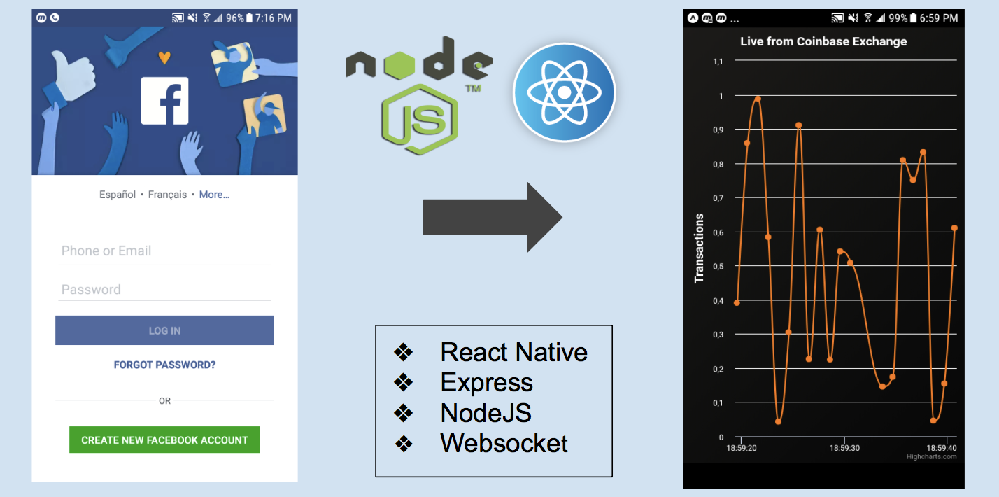

# Demo - Scaling Microservices With Kubernetes

## Purpose

In the past few years, many enterprises had moved or are moving their software development architecture from Monolithic to Microservices.  Challenges remain when building an Application at scale including Scalability and Reliability.  Kubernetes has been chosen as a popular tool for building Microservices as it provides many features addressing these challenges.  

My Demo aims to demonstrate Kubernetes autoscaling features, in particular the Horizontal PODs (Microservices) Autoscaling, in addition to the options available from Cloud Service Provider such as AWS Auto Scaling Group (ASG).  

Taking into consideration of Fault Torlerancy, I have built a Multi-Master, Multi-Availabiilty Zones Kubernets Cluster on AWS Cloud using kops + terrform.  Additionally, considering N+1 Redundancy Design, I have created an odd-numbered (starting with 3) Multi Kubernetes Worker-Nodes on multiple AWS Availability Zones as well.  

## Kubernetes Data Pipeline As Microservices

Considering Kubernetes' POD (Microservice) architecutre, I have built a Data Pipeline integrating Kafka Cluster as Microservices, to illustrate a Streaming Processing Event-Driven Microservice Architecture.  

My streaming data source comes from a Coninbase Exchange websocket channel.  Coninbase Exchange is similar to NY Exchange, but for exchanging Cryptocurrencies.  Coinbase currently has approimately 2300+ Cryptocurrencies on its Exchange list, and is streaming each BUY, SELL, and TRADE transaction from each Cryptocurrency on various Blockchain Networks including Bitcoin or Ethereum.   The potential for the use cases of this streaming data is vast, because the data can be analyzed to suit countless numbers of business needs.

Below is the Data Piepline.

## Monitoring - Prometheus and Grafana as Microservices

Monitoring can be an engineering challenge for Microservice Architecture because many technologies are involved in the process - Kubernetes, AWS, Kafka, MongoDB, etc.  Each technology requires Monitoring of its own.  For this reason, I have integrated my Kubernetes Cluster with Prometheus and Grafana. 

With these Monitoring tools, I am able to showcase Microservices auto scale up and down, based on Load Testing using Apache Benchmark.  Technologies such as Kafka requires additional configurations, which I was able to do.  Thus, Monitoring is certainly a pain point in this process.

## Front End UI Authentication and Charts - MongoDB as a Microservice

I have built a Mobile App that have been tested on both physcial Android device and iOS simulator.  My Mobile app would authenticate a user via Facebook's Oauth2, and in turn, with the user's permission, the user's Facebook ID, Email and Name will be persisted in a MongoDB POD on Kubrernetes Cluster.  Once authenticated, the user is 'authorized' to see the Charts, which display the BUY and SELL prices of Bitcoin in a time-series events.

